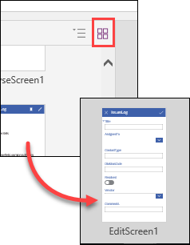
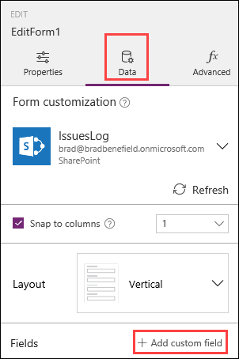

<properties
   pageTitle="Add a cascading drop-down list | Microsoft PowerApps"
   description="Add a data source and then add some cascading drop-down lists"
   services=""
   suite="powerapps"
   documentationCenter="na"
   authors="v-subohe"
   manager="anneta"
   editor=""
   tags=""/>

<tags
   ms.service="powerapps"
   ms.devlang="na"
   ms.topic="get-started-article"
   ms.tgt_pltfrm="na"
   ms.workload="na"
   ms.date="06/20/2017"
   ms.author="v-subohe"/>

# Cascading drop-down lists
In the last video, we learned some basic information about forms and how forms combine with columns in our SharePoint lists. We also learned about locking and unlocking property settings in order to customize forms.

In this section, we'll add a set of cascading drop-down controls so that when a user selects a Zone, a drop-down list will display the available subcodes, or Division Codes, for that zone. Then, we'll update the Division Code field with the selected subcode. 

## Add a data source to use for the cascading drop-down list 

First, we'll need to connect to the data source that has the data we need for the cascading drop-down lists.

**Note:** There's already a data source connection to **IssuesLog** that was created in the previous video.

1. In the right-hand pane, click or tap **Add data source**. In the list of connections, click or tap the connection you want to use.

   **Note:** If you don't see the connection you want to use, click or tap **New connection**.

   

2. Under **Connect to a SharePoint site**, copy and paste the URL for the SharePoint site (in the example, it's https://microsoft.sharepoint.com/teams/PlanningTeamSite), and then click or tap **Go**.

   PowerApps searches for all of the lists that are available on the SharePoint site. In the list, find **Zones** and select it. Then, click or tap **Connect**. In the right-hand pane, notice that there are now two data sources in the list.

   

  **Note:** With PowerApps, you can add many types of connections. For example, you can add a connection to Dynamics 365 and include account data from Dynamics 365 at the same time you're submitting data to a SharePoint list. You can also add connections to third-party applications.

## Add cascading drop-down lists
Now that you've added the **Zones** connection, add the cascading drop-down lists to the form.

1. In the left-hand pane, select the icon to switch to thumbnail view, and select **EditScreen1**. 

   

1. With **EditForm1 selected**, select **Data** in the right-hand pane, and then select **+ Add custom field**.

   

2. On the **Insert** tab, click or tap **Controls** and then click or tap **Drop down**.

   

   We'll add two drop-down lists, one for the top-level **Zones**, and the second for the **Subcodes**, or Division Codes.

   When creating the second drop-down list, you can just copy the first one and move it down. Click **Home**, and rename the first drop-down list **ddZones** and the second one **ddSubCodes**.

   

3. Click or tap the first drop-down list, **ddZones**, and select **Items** in the property list. In the formula bar next to **Items**, type the following: 

    **Distinct(Zones,Title)**.

    **Note**: The **Distinct** function is used because there are multiple items in the **Zones** list in SharePoint that have the same value for **Title**. 

   

4. Click or tap the second drop-down list, **ddSubCodes**, and select **Items** in the property list. In the formula bar next to **Items**, type the following:

   **Filter(Zones,Title=ddZones.Selected.Value).SubCode**

   This function retrieves the data in **Zones** where the **Title** field is equal to the value in **ddZones** and returns the subcodes, or Division Codes.

      

5. Run the app to see if the cascading drop-downs work correctly.

## Update the Division Code field 
Next, we'll configure the app to automatically update the **Division Code** field with the subcode value that the user selected, so when the record is saved, the **Division Code** will also be written to the SharePoint record.  

1. In the form, drag and drop the card you created for the drop-down lists to the space above the **Division Code** field.

   

2. Click or tap the **Divison Code** field, select **Fx Advanced** in the right-hand pane, and unlock the field. Select **Default** in the property list, and in the formula bar, type the following: 

    **ddSubCodes.Selected.Value**.

   This formula changes the default value of the **Division Code** field to whatever is selected in the **ddSubCodes** drop-down list.

3. (Optional) Since the **Division Code** field simply displays the **ddSubCodes** selection, it doesn't need to be displayed to the user, and you can free up some screen space in your app by hiding it.  Select **Visible** in the property list for **Division Code**, and in the formula bar, type **False**.
