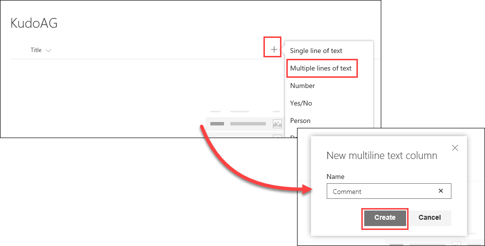
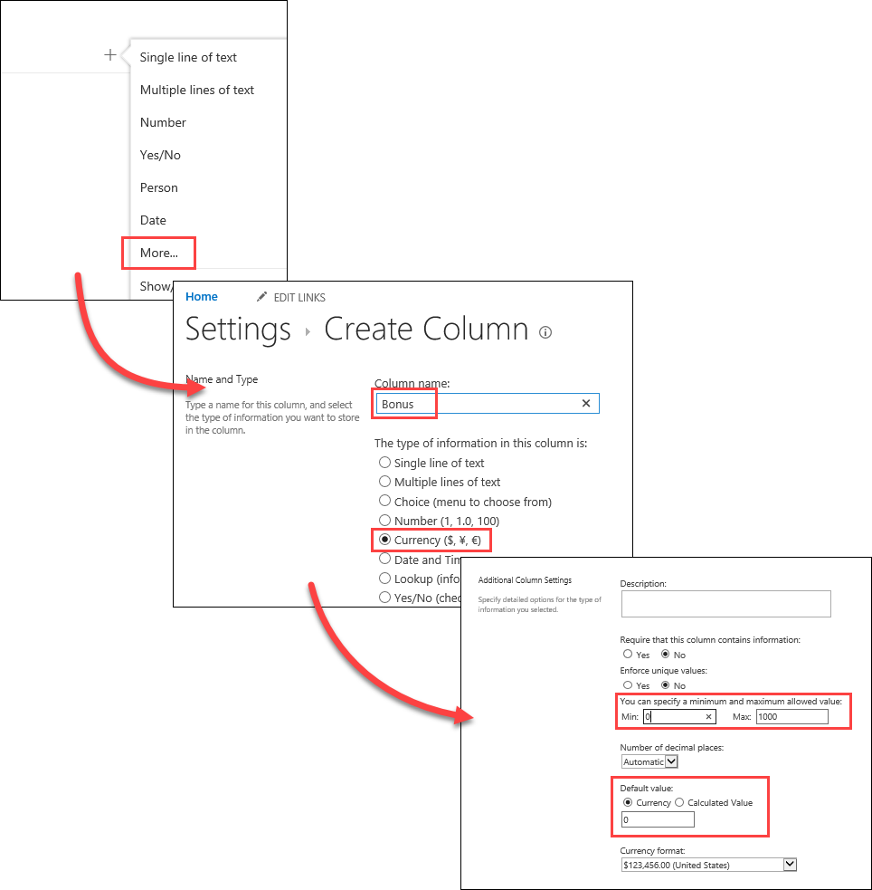
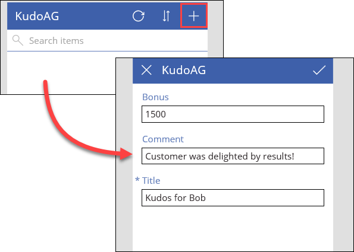

<properties
   pageTitle="Best Practices: Error Management | Microsoft PowerApps"
   description="Error management and validation in your apps"
   services=""
   suite="powerapps"
   documentationCenter="na"
   authors="v-brbene"
   manager="anneta"
   editor=""
   tags=""
   featuredVideoId="os33pHQ9jSU"
   courseDuration="6m"/>

<tags
   ms.service="powerapps"
   ms.devlang="na"
   ms.topic="get-started-article"
   ms.tgt_pltfrm="na"
   ms.workload="na"
   ms.date="07/12/2017"
   ms.author="v-brbene"/>

# Error management

In this learning module, we’re going to talk about error management validation in your PowerApps apps.

## Create a test app

First, you’ll need a simple SharePoint list to work with in order to demonstrate the concepts.  In your SharePoint site, create a list called **KudoAG**, and add two columns with the following properties:
- **Column Type**: Multiple lines of text, **Name** = Comment
- **Column Type**: Select **More...**, then **Currency**, **Name** = Bonus, **Min** = 0, **Max** = 1000, **Default value** = Currency, 0

Now, let’s build an app from SharePoint like we did in a previous video. In the SharePoint list, click **PowerApps**, then select **Create an app**.  Name it **Kudo Draft**, and click **Create**. 

When the app is finished building, run the app. 

Click the “**+**” in the upper right corner to add a new record with the following values:
- **Bonus**: 1500
- **Comment**: Customer was delighted by results! 
- **Title**: Kudos for Bob

Click the checkmark to save the record, and you’ll receive an invalid entry error notice and a prompt to enter a value between 0 and 1000. This comes from the restriction that you set on the **Bonus** column in SharePoint. When you submitted the record to be saved, SharePoint detected that the value was not in the specified range and returned the error. 

Close the app by clicking the **X** in the upper right corner. 

## Configure validation in PowerApps

Now, let’s create the data validation in PowerApps so it detects any errors **before** the user tries to save the record.

First, you’ll need the name of the **Bonus** field.  Select the **Bonus** label and write down its name, which is displayed in the right pane. 

Zoom in if necessary, and select the text label with the error message, right below the **Bonus** field. Note that the value for the **Text** property is **Parent.Error**. In this case, the parent is SharePoint, which returned the error that the value was not within the range. 

Instead of having the **Text** property display the error from SharePoint, we’ll configure the property so that it checks the value as soon as the user enters it.

Ensure the field is unlocked for editing by clicking the lock icon in the right pane.

In the **Text** property, delete **Parent.Error** and enter the following formula, using the name of the **Bonus** field that you previously wrote down:

**If(Value (*BonusFieldName*.Text) > 799, “Please keep this number under 800”, parent.error)**

This formula:
- Uses the **Value** function to convert the text entry in the **Bonus** field to a number 
- Checks if the value of the bonus is less than 800
- Displays the message **“Please keep this number under 800”** if the value is 800 or greater

Using this method, invalid values are caught as soon as the user enters a number, before they try to save the record. Run the app and test it by creating a new record. Try different values in the **Bonus** field to verify that the validation is working correctly. 

As a best practice, pre-validating fields not only helps performance of the app, but enhances the customer experience as well. 

