<properties
   pageTitle="The Common Data Service: Create an Entity | Microsoft PowerApps"
   description="Create Custom Entities with the Common Data Service"
   services=""
   suite="powerapps"
   documentationCenter="na"
   authors="v-brbene"
   manager="anneta"
   editor=""
   tags=""
   featuredVideoId="os33pHQ9jSU"
   courseDuration="7m"/>

<tags
   ms.service="powerapps"
   ms.devlang="na"
   ms.topic="get-started-article"
   ms.tgt_pltfrm="na"
   ms.workload="na"
   ms.date="6/22/2017"
   ms.author="v-brbene"/>

# Custom Entities in the Common Data Service

In the previous video, we created an app using a standard entity, **Products**. In this video, we’ll create a custom entity and use that to build an app that displays flooring options, such as carpet, tile, and hardwood. We’ll also use existing entities to create **relationships**, and explore how to use a **picklist**.

First, let’s look at the data in the **FlooringEstimates.xls** spreadsheet. 

- **Name** – A text field with the name of the product.
- **ProductID** – This text field is empty in the spreadsheet, but we’ll use **lookups** to pull in data from an existing entity. 
- **Category** – A text field with the category of the product.
- **Product Type** – A text field. 
- **Selling Unit Price** – A currency field in USD. 
- **Status** – This field will be formatted as a picklist.  

## Create a new entity

On the **PowerApps** page, expand **Common Data Service**, and click **Entities**. On the **Entities** page, click **New entity**. 

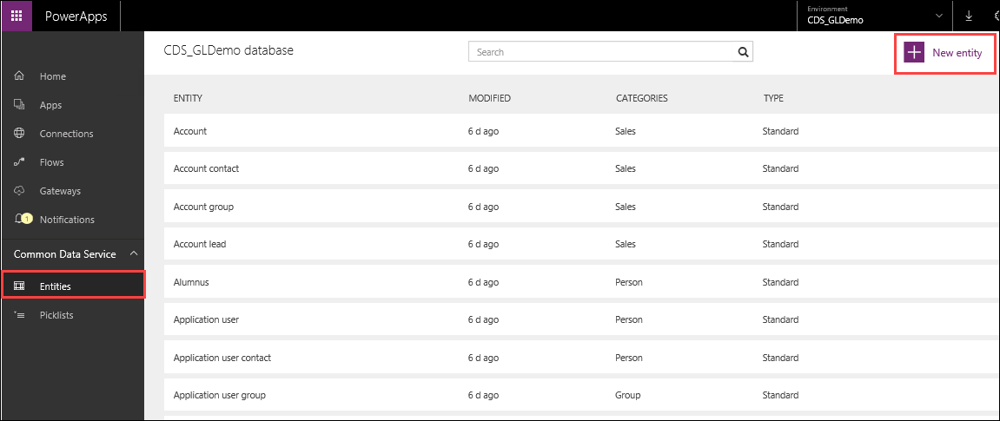

Add the following values and click **Next**. 
- **Name** – FlooringEstimates
- **Display Name** – Flooring Estimates
- **Description** - This is an entity used to show various flooring options and estimates.

PowerApps automatically creates a new entity with some default fields. Next, we’ll create the fields we need to match the data in the spreadsheet - the **Name**, **Category**, **Product Type**, and **Description** fields.

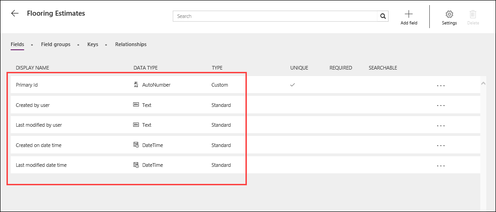

## Add new fields to an entity

Click **Add field**, add the following values, and click **Add Field**. 
- **Display Name** – Name
- **Name** – Name
- **Type** – Text

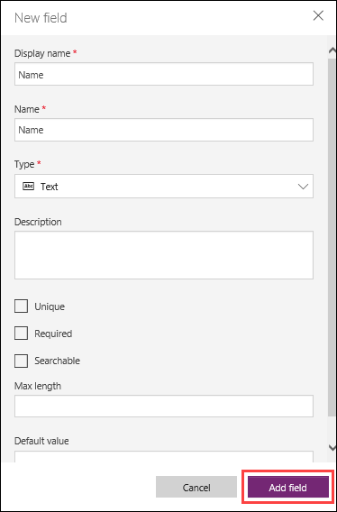

Repeat the steps above to add the **Product Type** and **Category** fields.

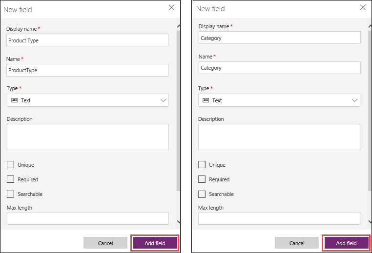

Repeat the steps again to add the **Description** and **Selling Unit Price** fields, but note the different values in the **Type** field. **Description** is **Multiline Text**, and **Selling Unit Price** is **Currency**. 
 
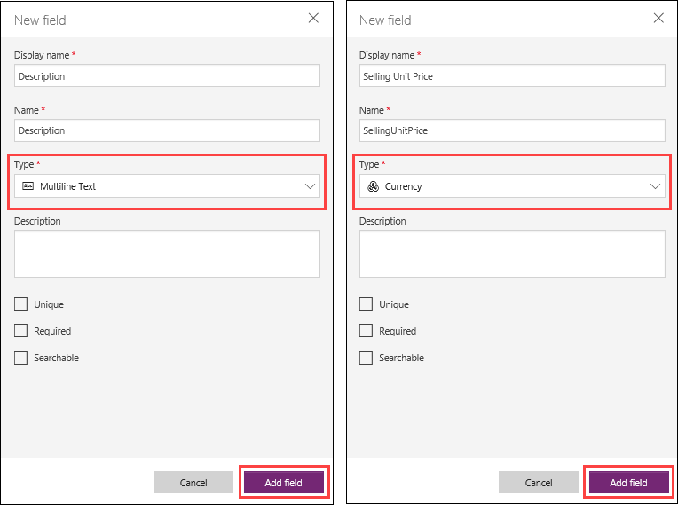

Click **Save Entity**. 

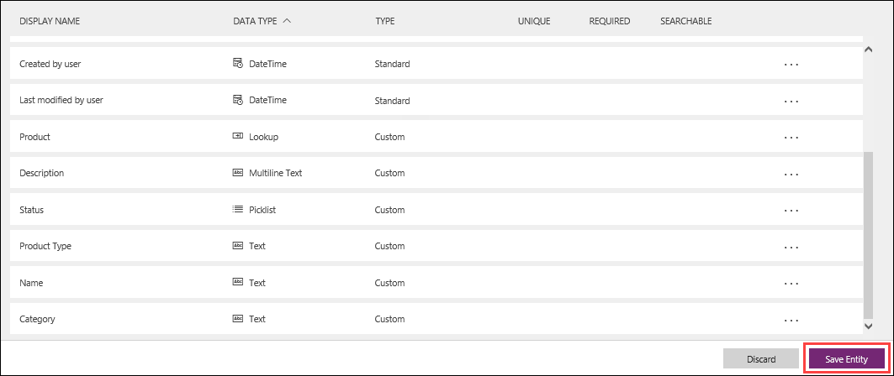

## Lookups and Picklists

To populate data into the **Product ID** field, we’ll leverage some sample data that is already in an existing entity, **Product**, by using a lookup.

Click **Relationships**, and then click **Add relationship**. 
 

In **Related entity**, select **Product**. The remaining fields are filled in automatically and the **Relationship type** is set to **Lookup**. Click **Add relationship**. 
  
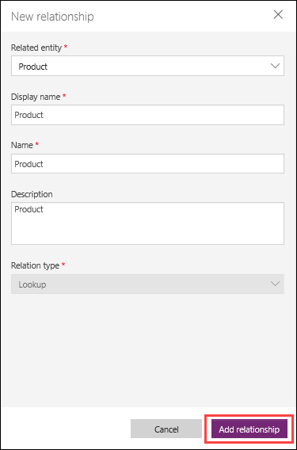

To create values for the **Status** field, we’ll use an existing picklist, also named **Status**. The picklist contains two values, **Active** and **Inactive**. 

Click **Fields**, and then click **Add field**. Add the following values and click **Add field**. 

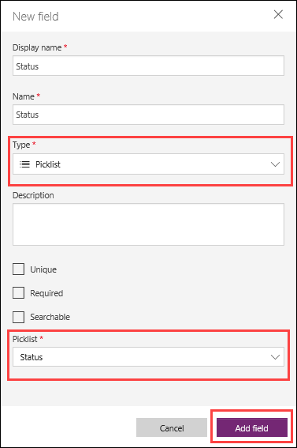

Our custom entity **FlooringEstimates** now has all the fields that match the spreadsheet that we want to import. Click **Save entity**.

## Import data into the entity

On the **FlooringEstimates** property page, click **Import data**.

Search for **FlooringEstimates.xl**s and click **Open**. 

PowerApps will try to map the fields in the spreadsheet to the fields created in the entity. In this case, the mapping status should display **Partial Match**. Click **Show mapping**.

Notice that the only field that doesn’t match is **ProductID**. From the dropdown list for **ProductID**, select **PRODUCT_PRODUCTID**.  This is the relationship that was created between the **Product** entity and the **FlooringEstimates** entity.  Click **Save changes**.
   
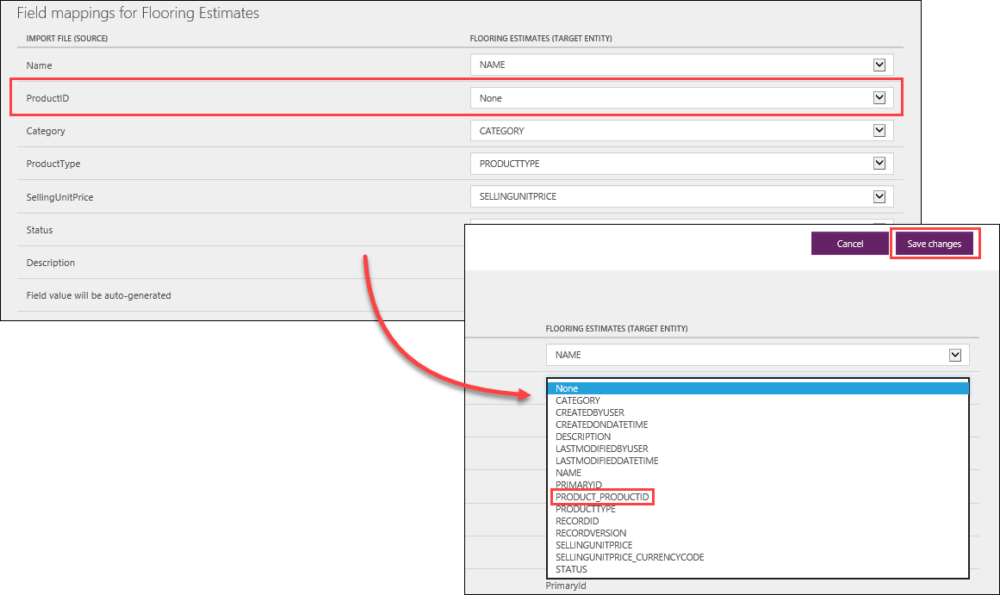

Verify that the status shows a match (green checkmark), then click **Import**. 
 

## Using a lookup to import data

Click the back arrow, and open the **FlooringEstimates** entity. Click **Open in Excel**, and when prompted to **Open** or **Save**, click **Open**. 

When Excel opens, click **Enable Editing**. If prompted, click **Trust this add-in**. 

Once you’re authenticated, it will take a minute to retrieve the metadata, and the spreadsheet will populate with the data. Notice the **Product** field is empty. 

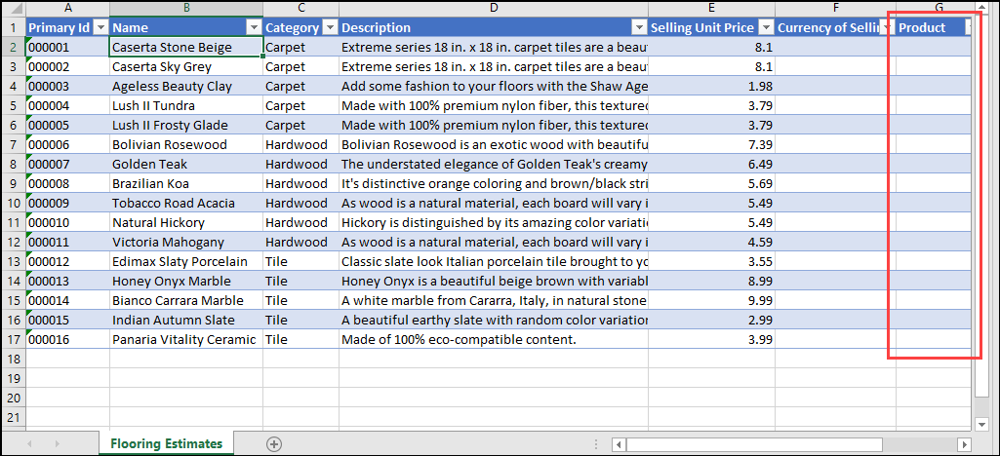

Click the first cell in the **Product** column, and the **Product** entity data will load and display a lookup table on the right. 

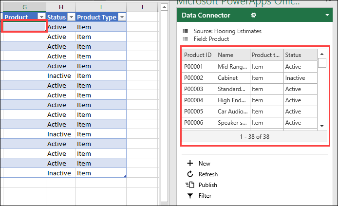

Click the first cell in the lookup table, **P00001**, and it will automatically populate the selected cell in the **Product** column on the left. 

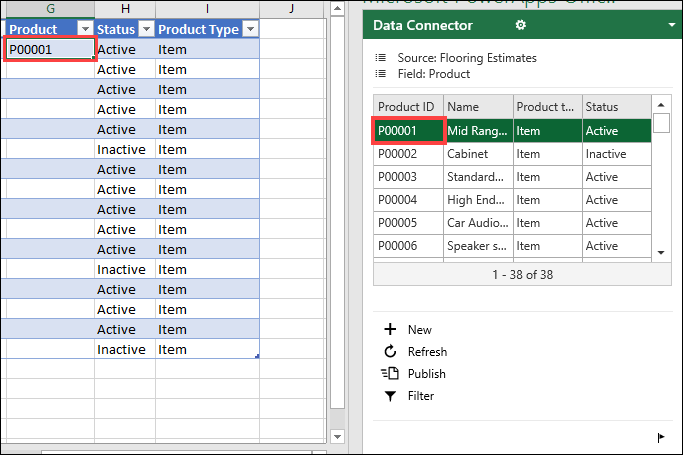

Click the second cell in the **Product** column, and then select the second cell, **P00002**, in the lookup table.  Continue to populate the **Product** column this way for the remaining records. 

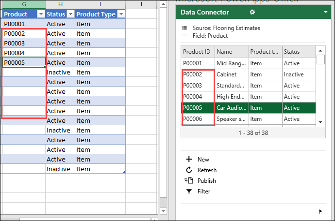

When you update a spreadsheet with this method, you must publish the changes, in addition to saving them. In the same right-hand dialog, click **Publish**. 

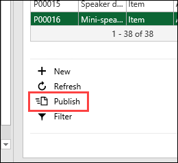

Then, close the spreadsheet by clicking the **X** in the upper right corner and **Save** the changes. 

On the **FlooringEstimates** property page, click **Data**. When the updated data displays, scroll to the right and verify that both the **Product** and **Status** fields have been updated.

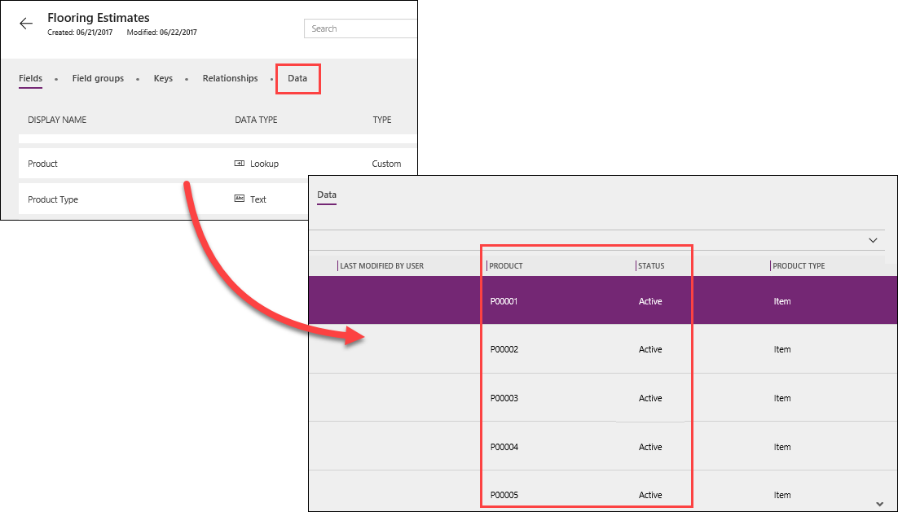

## Build the app

Click **New app**, click **Phone layout** for the Common Data Service, select the **Flooring Estimates** entity, and then click **Connect**. 

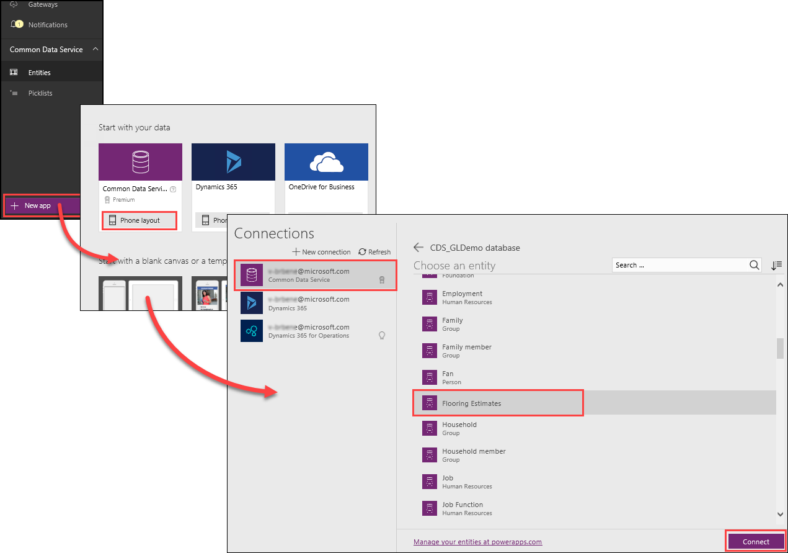

Click **Play**, and walk through the features of the app. You can search for items, view details of an item, or even add a new item. 

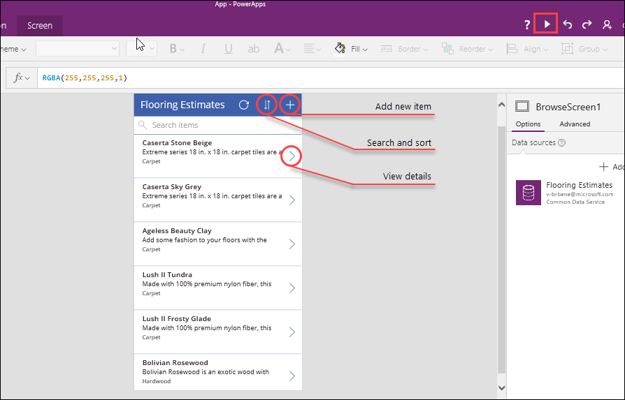

Next, we’ll look at managing security in the Common Data Service. 

