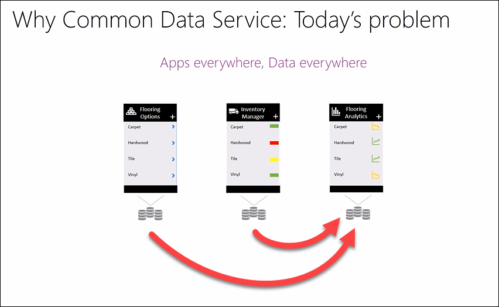
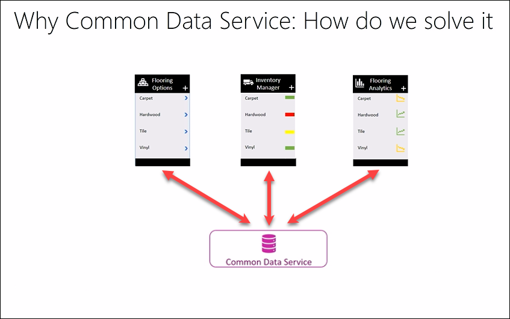
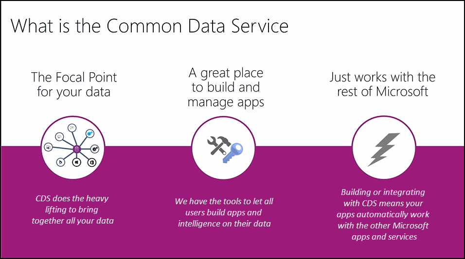

<properties
   pageTitle="The Common Data Servic: Overview | Microsoft PowerApps"
   description="An overview of this powerful way to store and model data"
   services=""
   suite="powerapps"
   documentationCenter="na"
   authors="v-brbene"
   manager="anneta"
   editor=""
   tags=""
   featuredVideoId="TBD"
   courseDuration="4m"/>

<tags
   ms.service="powerapps"
   ms.devlang="na"
   ms.topic="get-started-article"
   ms.tgt_pltfrm="na"
   ms.workload="na"
   ms.date="6/9/2017"
   ms.author="v-brbene"/>

# The Common Data Service
In this series of videos, we’ll find out about the Common Data Service, explain the data model that we use, and look at the different types of entities used with the Common Data Service. Then we’ll create a custom entity and build an app together. 

## What is the problem that we’re trying to solve today?
For our working scenario, we’ll use a flooring company where the IT department has been tasked to build a set of line-of-business applications. 

In the image above, we have a flooring app which shows the various types of flooring options available – carpet, tile, hardware, etc. The second app is for inventory and invoicing, and the third one will give us analytics – understanding what’s happening with the business, and what kind of insights we can gain. For each app, the IT department needs to set up data sources, and pull in the data to build that app. These data sources can be as simple as a spreadsheet, or, for example in the inventory manager app, they may connect to an inventory or invoicing system behind the scenes. It can get more complicated for the analytics app, as there is time and effort involved in pulling data from multiple repositories, for example from both the flooring options data repositories and the inventory or invoicing system repositories. This is a huge burden on the IT department in terms of the cost and effort in maintaining, configuring, and keeping the data in sync between numerous data sources.

## Solving the Problem

With the Common Data Service, you don’t necessarily need to maintain or invest in expensive and intricate systems. We have put in the time and effort to create a service that ties together data from disparate systems. With the Common Data Service, we do the heavy lifting for you, so you can focus on what matters most – building apps, driving compelling experiences, and gaining valuable insights. With the Common Data Service, your apps are smarter, because they can pull data from other apps. 

# What is the Common Data Service?

- The Common Data Service is the focal point for all your data. We do the underlying work to pull all your data together in one place. 
- It’s a great place to build and manage apps. We provide you with a set of tools appropriate for a novice developer all the way to a pro developers. 
- Best of all, it just works. Building on the Common Data Service, your apps automatically work with the rest of Microsoft’s apps and services. 

In the next video, we'll build an app using data from the Common Data Service.
