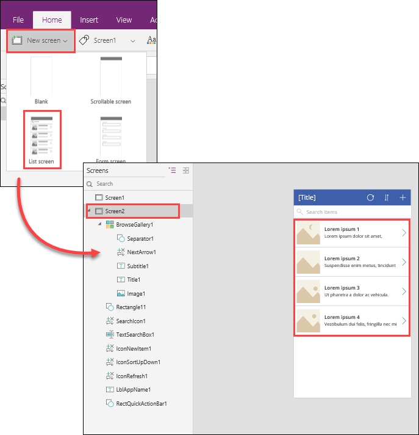

<properties
   pageTitle="Create a data source by using a formula | Microsoft PowerApps"
   description="Build a data source using only a formula and, later, use the data source to build galleries."
   services=""
   suite="powerapps"
   documentationCenter="na"
   authors="skjerland"
   manager="anneta"
   editor=""
   tags=""/>

<tags
   ms.service="powerapps"
   ms.devlang="na"
   ms.topic="get-started-article"
   ms.tgt_pltfrm="na"
   ms.workload="na"
   ms.date="10/10/2017"
   ms.author="sharik"/>

# Create a data source using a formula
In this topic, you'll use a formula to create a collection in PowerApps Studio for Windows, which you'll then use as a data source to build a gallery in the next topic. When using PowerApps Studio for web, the process may vary slightly.

## Collections and records
A collection stores data that your app uses. In this example, you'll use a formula to create a collection named **CitySales**. The formula uses the **ClearCollect** function, which clears (deletes) all the records from a collection and then adds a different set of records to the same collection. If the collection doesn't exist, it will create the collection.

## Create a collection
Open PowerApps and click or tap **New app**, and then on the **Blank app** tile, click or tap **Phone layout**. On the **Home** tab, click or tap **New Screen**, and then click or tap **List screen** to create a new screen. You'll see the default list template appear in the app.

With the new screen selected, click **OnVisible** in the property list drop-down, and then copy the following text and paste it into the formula bar next to **OnVisible**:

ClearCollect(CitySales,{City:"New York", Country:"United States", Short: "NY", Sales:73165400},{City:"Los Angeles", Country:"United States", Short: "LA", Sales:3065500},{City:"Seattle", Country:"United States", Short: "Sea", Sales:1657500},{City:"Boston", Country:"United States", Short: "Bos", Sales:5965200},{City:"Berlin", Country:"Germany", Short: "Ber", Sales:3562000},{City:"Rome", Country:"Italy", Short: "Rom", Sales:2874000},{City:"Paris", Country:"France", Short: "Par", Sales:2273000},{City:"Dijon", Country:"France", Short: "Dij", Sales:1602000},{City:"Hamburg", Country:"Germany", Short: "Ham", Sales:1760000},{City:"Munich", Country:"Germany", Short: "Mun", Sales:1494000},{City:"Milan", Country:"Italy", Short: "Mil", Sales:1344000})

**Note:** This text is properly formatted for PowerApps, but in general when you're copying text for use in PowerApps, it's a good idea to copy it from a text editor, and not a word processor. Using a word processor, such as Word, can introduce unintended formatting (for example, curly quotes) into the text, which PowerApps won't recognize.

The text you copied and pasted into the formula bar contains the **ClearCollect** function with a list of sales figures from several countries and cities. To see the entire formula, expand the formula bar by dragging down the bottom edge.

In the left-hand pane, select **Screen1**, click the properties menu **(...)**, and then select **Delete**.

To review the collection to ensure that the data is there, click or tap the **View** tab, and then click or tap **Collections**. You won't see all of the data in the table, only the first five rows.

To save the app to the cloud, click or tap **Save as**, give it an appropriate name, and then provide a description. A helpful tip when saving an app is to change the icon. This makes the app stand out in the list and people can easily find it.

Now that you've created a collection, let's move on to the next topic, where you'll use the collection to build a gallery.
