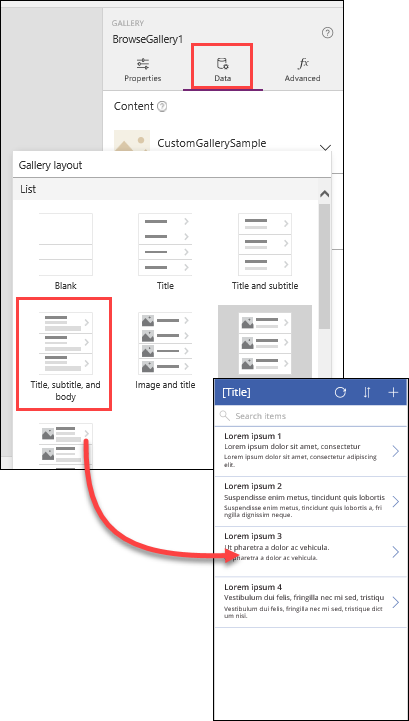
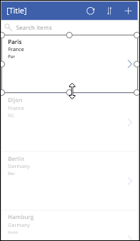
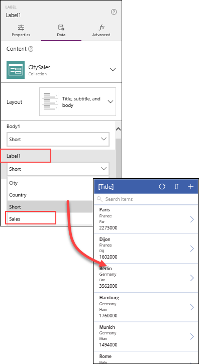

<properties
   pageTitle="Display data in a collection using a gallery | Microsoft PowerApps"
   description="Display data in a collection using a gallery and modify some of the fields"
   services=""
   suite="powerapps"
   documentationCenter="na"
   authors="v-subohe"
   manager="anneta"
   editor=""
   tags=""/>

<tags
   ms.service="powerapps"
   ms.devlang="na"
   ms.topic="get-started-article"
   ms.tgt_pltfrm="na"
   ms.workload="na"
   ms.date="07/24/2017"
   ms.author="v-subohe"/>

# Display data in a collection using a gallery
In this topic, you'll use the data in a collection to populate a gallery and then change some of the fields in the gallery template.

If the app created in the previous topic isn't saved, save it now. In the left-hand pane, click or tap **Save As** (or press Ctrl-Shift-S). Make sure to save the app to the cloud, give it an appropriate name, and provide a description.

## Select a gallery layout and theme
First, you need select a gallery layout that best displays the data. Notice that the default gallery layout contains a graphic placeholder. The data doesn't need to display any graphics, so select a layout that only displays text.

Make sure that the gallery is selected, and in the right-hand pane, click or tap **Data**, click or tap the **Layout** drop-down, and select the **Title, subtitle, and body** layout. Note that the layout changes to a group of text fields. 

  

(Optional) On the **Home** tab, click or tap **Theme**. Select a color theme to use for the app. The theme can be changed at any time, and PowerApps will automatically color the controls to fit the new theme.

## Load the data from the data collection
Next, we'll configure the gallery to display the data from our collection. Select the gallery and look at the formula displayed in the formula bar. 

**SortByColumns(Search(CustomGallerySample, TextSearchBox1.Text, "SampleText"), "SampleText", If(SortDescending1, SortOrder.Descending, SortOrder.Ascending))**

The **SortByColumns** function is described in detail in the documentation, but let's look at just the three fields that affect the gallery. 

- **CustomGallerySample** - this indicates the data source in which to look for the search term. **CustomGallerySample** is the default sample data that loads when you create a gallery. 
- **SampleText** and **SampleText** - these are both column names in the data source. The first one indicates which column to use during a search, and the second indicates which column to use when sorting. 

Modify the formula as follows so that it uses the **CitySales** data collection, searches on **City**, and sorts by **Country**. 

SortByColumns(Search(**CitySales**, TextSearchBox1.Text, "**City**"), "**Country**", If(SortDescending1, SortOrder.Descending, SortOrder.Ascending))

Your app should now display something similar to this:

  

## Change elements in the gallery template
You can customize the gallery by changing some of the elements, and adding or removing fields.

You may have noticed that the layout only has three fields, while the data collection has four columns. To add another field to the gallery template:

1. Select the first item and drag the bottom down to make some extra room.

   

2. Add a new text label from the **Insert** tab. 

   

3. In the right-hand pane, select the drop-down for the new label and select the field that isn't displayed yet. 

   

To change the title of the gallery, double-click or tap in the title area of the gallery to select it, then type a new title, for example **Flooring Sales**.

  

Since you won't be adding new items to the data using this app, you can hide the "add new" (**+**) icon in the title area of the gallery. To do this, click or tap the (**+**) icon to select it, and select **Visible** in the property list. Then, in the formula bar, change the variable to **false** to hide the icon.

  

Similarly, since all the information for an item is on the gallery screen, you won't need the "**>**" icon in the gallery template to view the details of an item. Select the ""**>**" icon, and set the **Visible** property to **false**. 

Click **File** and **Save** to save your work, or press **Ctrl+S**. 
