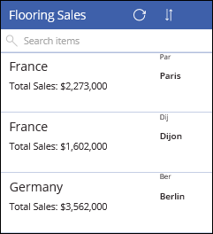
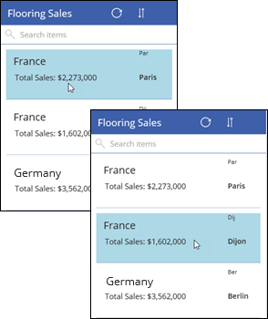
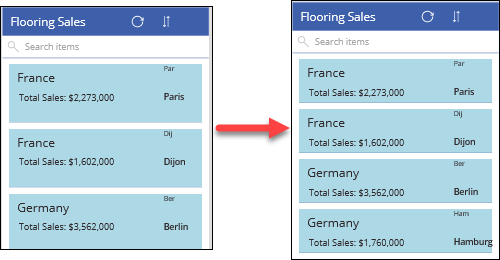

<properties
   pageTitle="Customize a gallery template | Microsoft PowerApps"
   description="Format fields, align multiple fields, and change colors to customize a gallery template"
   services=""
   suite="powerapps"
   documentationCenter="na"
   authors="skjerland"
   manager="anneta"
   editor=""
   tags=""/>

<tags
   ms.service="powerapps"
   ms.devlang="na"
   ms.topic="get-started-article"
   ms.tgt_pltfrm="na"
   ms.workload="na"
   ms.date="10/09/2017"
   ms.author="sharik"/>

# Customize a gallery template
Previously, you created a collection using a formula, used that collection to populate a gallery, and then changed some of the fields in the template. In this topic, you'll take it a step further and customize the gallery template by formatting fields, aligning multiple fields, and changing background color.

## Format fields
In your **Flooring Sales** template, it's not obvious that the sales figure is currency and that it represents total sales. To reformat the sales figure to make its intent clearer, select the field that shows the sales figure in the gallery, and then change the formula in the formula bar to the following:

**"Total Sales: " & Text(ThisItem.Sales,"$#,#00")**

Notice that the sales figures now display in a currency format and it's clear that the value represents total sales.

## Arrange fields in a template

When data is loaded into a gallery template, it's not necessarily formatted or laid out the way you want it. For example, in your template, the **City** and **Short** fields overlap with other fields.

To fix this, select the **City** field, and then select **Width** in the property drop-down list. Enter **Parent.TemplateWidth/4** in the formula bar, so the field occupies only one-quarter of the template width. Make the same changes to the **Short** field.

Now, move the **Short** field to the upper-right area of the template, and move the **City** field underneath it:

Select the **Country** field and increase the font size (**Size** property) so it's easier to see. Move the **Country** field toward the top of the template, and then select the **Sales** field and move it underneath the **Country** field. The template is starting to shape up now!

Let's continue to refine it. Move the **City** field down so that it's lined up with the **Sales** field. As you drag a field, or any control, PowerApps displays alignment guides. Notice that the **City** field aligns horizontally with the **Sales** field, and the left edge aligns vertically with the **Short** field.  

## Align multiple fields in a template

In addition to the built-in alignment guides, you can use the Crtl key to select multiple fields to align. For example, to align the **Country** and **Sales** fields in your template, hold down the Ctrl key, and then select both the **Country** and **Total Sales** fields. On the **Home** tab, click or tap **Align**, and then click or tap **Align left**.

**Tips:**
- As you move fields around a template, be careful that fields don't overlap each other. To reduce the size of a field that's overlapping another field, drag the corner of the overlapping field to make it smaller. As you move the field, PowerApps automatically aligns it.

- After arranging fields, if the template has too much blank space, drag the bottom edge of the template up to reduce the overall size.

## Change background color, padding, and size of a template

There are three gallery template properties that are particularly useful when laying out your gallery: **TemplateFill**, **TemplatePadding**, and **TemplateSize**.

To change the background color of a template, select **TemplateFill** in the property list, and then in the formula bar, delete the current color and change it to a different color.

Another way to use the **TemplateFill** property is to use an **If** function to change the color of an item when it's selected, and then change it back to the original color when it's not. To see how this works in your template, add this formula to the **TemplateFill** property:

**If(ThisItem.IsSelected,LightBlue,White)**

Try it out! When you select an item, the background color changes to light blue, otherwise, it remains white.

To add space (padding) around the edge of a template, select **TemplatePadding** in the property list, and then set the padding amount in the formula bar. To automatically adjust the template to the size of the data it displays, set the **TemplateSize** property. To see how these properties work in your template, enter the following in the formula bar:

**Subtitle2.Height + Label1.Height + 20**

This formula adds the height of the **Country** field (**Subtitle2**), the height of the **Total Sales** field (**Label1**), and **TemplatePadding** of **20**. If either field expands to accommodate a large of amount of data, the template expands automatically, too.

In the next topic, you'll add a drop-down control to your gallery to help you search for data within the gallery.
