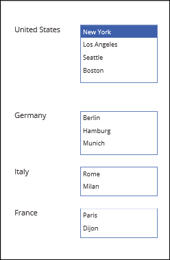
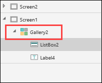

<properties
   pageTitle="Customize the height of list boxes in a gallery | Microsoft PowerApps"
   description="Make the height of list boxes in a gallery variable using a function"
   services=""
   suite="powerapps"
   documentationCenter="na"
   authors="v-subohe"
   manager="anneta"
   editor=""
   tags=""/>

<tags
   ms.service="powerapps"
   ms.devlang="na"
   ms.topic="get-started-article"
   ms.tgt_pltfrm="na"
   ms.workload="na"
   ms.date="06/05/2017"
   ms.author="v-subohe"/>

# Customize the height of list boxes in a gallery
In the previous section, you created a flexible height gallery and used the **GroupBy** function to group the data by countries. Then, you added a list box to the gallery and displayed the cities for each country. Because it's a flexible height gallery, the list boxes are set to a predefined height, and some of the list boxes are too large for the data that's shown in them. In this section, you'll make the height settings for the list boxes variable.

## Make the height of list boxes variable

To do this, we need to know how many rows are in the list box, and how high each row should be. We'll use the **CountRows** function to do this. 

In the gallery template, click or tap inside the list box to select it, and then select **Height** in the property list. In the formula bar, you'll see that the **Height** property has a default value of **225**.  Replace it with the following formula:

**CountRows(Cities) * 55**

The function counts the number of rows in the list box, and then multiplies that number by a row height of 55. (55 is given as an example. The row height for an app will depend on things like font size and readability.)

When you run the app, you'll see that the list boxes adjust depending on the number of cities listed.

## Customize a list box using other settings

In this section, you'll modify the list box and layout in order to add a sales total to each item. 

### Reduce text size
With the list box selected, click or tap the arrow next to the **Size** icon and then select a smaller value, such as **18**. Alternatively, select **Size** in the property list, and then type a smaller size in the formula bar.

### Remove borders
On the **Home** tab, click or tap **Border**, select **Border style**, and then select **None**.

### Move the list box to accommodate more fields
Move the list box by dragging it to the left side of the template, underneath the **Country** field.

Adjust the width of the **Country** field to make room to display the sales total on the right side. With the **Country** field selected in the template, select **Width** in the property list, and then type **Gallery2.TemplateWidth/2** in the formula bar. This automatically resizes the **Country** field to one half the width of the template.

 

**Note:** Depending on your app, your gallery may not be named **Gallery2**. You can verify the correct name in the left-hand properties pane. 

Copy and paste the **Country** field and move the copy to the right side of the gallery template, opposite the **Country** field. Change the **Text** property to the following function:

**Text(Sum(Filter(CitySales,Country=ThisItem.Country),Sales), "$#,###")**

This formula accomplishes three things:

- Filters all the sales numbers for a given country
- Totals all the sales numbers
- Formats the final total as text so it displays as currency

