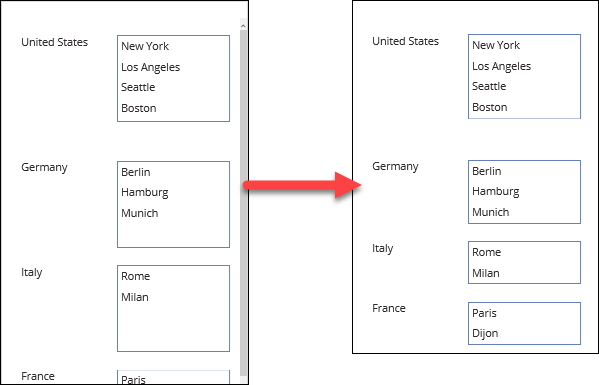
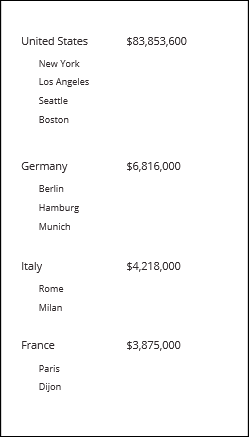

<properties
   pageTitle="Customize the height of list boxes in a gallery | Microsoft PowerApps"
   description="Make the height of list boxes in a gallery variable using a formula"
   services=""
   suite="powerapps"
   documentationCenter="na"
   authors="skjerland"
   manager="anneta"
   editor=""
   tags=""/>

<tags
   ms.service="powerapps"
   ms.devlang="na"
   ms.topic="get-started-article"
   ms.tgt_pltfrm="na"
   ms.workload="na"
   ms.date="10/11/2017"
   ms.author="sharik"/>

# Customize the height of list boxes in a gallery
In the previous topic, you added a list box control to your gallery to display the cities for each country. However, the list boxes are set to a predefined height, and some of them are larger than they need to be for the data they contain. In this topic, you'll make the height settings for the list boxes variable, and learn a few other ways to further customize the list boxes.

## Make the height of list boxes variable
Before you begin, you need to know how many rows are in the list box, and how high each row should be.

In the gallery template, click or tap inside the list box to select it, and then select **Height** in the property list. In the formula bar, you'll see that the **Height** property has a default value of **225**.  Replace it with the following formula:

**CountRows(Cities) * 55**

This formula counts the number of rows in the list box, and then multiplies that number by a row height of 55. (The row height for an app depends on things like font size and readability. The row height of 55 here is an example.)

When you run the app, you'll see that the list boxes adjust depending on the number of cities listed.

## Customize a list box using other settings
In this section, you'll modify the list box and layout to add a sales total to each item.

### Reduce text size
Select the list box, and on the **Home** tab, click or tap font size, and then change it from **21** to **18**. Alternatively, select **Size** in the property list, and then type a smaller size in the formula bar.

### Remove borders
On the **Home** tab, click or tap **Border**, select **Border style**, and then select **None**.

### Move the list box to accommodate more fields
Move the list box by dragging it to the left side of the template, underneath the **Country** field.

To make room to display the sales total on the right side, select the **Country** field in the template, select **Width** in the property list, and then type **Gallery2.TemplateWidth/2** in the formula bar (where **Gallery2** is the name of your gallery - you can verify the exact name in the properties pane on the left). This automatically resizes the **Country** field to one half the width of the template.

Copy the **Country** field and paste the copy on the right-hand side of the gallery template, opposite the **Country** field. To filter and total all of the sales numbers for a given country and display the total as currency, change the **Text** property to the following formula:

**Text(Sum(Filter(CitySales,Country=ThisItem.Country),Sales), "$#,###")**

### What's next
Congratulations! You've completed this section of the Guided Learning course for PowerApps. Now that you've created a data source and learned how to create and customize galleries, you're ready to create an app from a SharePoint list and customize that app. See you in the next section!
