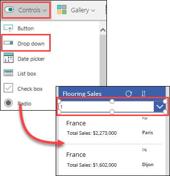

<properties
   pageTitle="Filter a gallery using a drop-down control | Microsoft PowerApps"
   description="Quickly search for data in a gallery using a filter drop down control"
   services=""
   suite="powerapps"
   documentationCenter="na"
   authors="v-subohe"
   manager="anneta"
   editor=""
   tags=""/>

<tags
   ms.service="powerapps"
   ms.devlang="na"
   ms.topic="get-started-article"
   ms.tgt_pltfrm="na"
   ms.workload="na"
   ms.date="05/30/2017"
   ms.author="v-subohe"/>

Another way to search for data in a gallery is to use a filter drop-down control. If you're using a drop-down filter in an app for mobile devices, however, drop-down controls are not always the best choice since they require precision. For mobile devices, it's better to use a radio button or a control that's larger.

## Create a drop down control
1. On the **Insert** tab, click or tap **Controls** and then click or tap **Drop down**. When the drop-down control appears in the gallery, resize or move the drop-down control to an appropriate location.

  

2. In the left-hand pane, search for **Dropdown1** and type a name for the drop-down control so that it's easy to find. For this example, the drop-down control is named **ddCountry**.

## Select data to filter
1. Determine the data that should be filtered on (for example, filter by country). Go to **Items** in the property list, and, in the formula bar, change the value to **CitySales**, which is the data in the collection.

2. It's a best practice to add the **Distinct** function to the **Items** property to make sure the data that's retrieved is filtered on specific items. To filter the **CitySales** data by the column **Country**, type the following in the formula bar:
**Distinct(CitySales,Country)**

3. Connect the drop-down control to the gallery by changing the value in the **Items** property for the gallery. Click or tap the gallery and make sure that **BrowseGallery1** is selected in the right-hand pane. In the left-hand pane, go to **Items** in the property list. In the formula bar, delete all of the text for the **Items** property and type the following:
**Filter(CitySales,ddCountry.Selected.Value in Country)**

The drop-down control is set to automatically filter the **CitySales** data by country.
