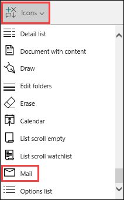

<properties
   pageTitle="Add icons to forms | Microsoft PowerApps"
   description="Add icons to forms"
   services=""
   suite="powerapps"
   documentationCenter="na"
   authors="v-subohe"
   manager="anneta"
   editor=""
   tags=""/>

<tags
   ms.service="powerapps"
   ms.devlang="na"
   ms.topic="get-started-article"
   ms.tgt_pltfrm="na"
   ms.workload="na"
   ms.date="06/25/2017"
   ms.author="v-subohe"/>

# Adding icons to forms
When creating apps for devices with smaller screens, such as mobile devices, drop-down lists aren't the ideal way for users to interact with an app. Instead, on a mobile device, it works better to use something such as large buttons or obvious images to select options in an app.

In this example, we'll add icons to our app so that when users select an option for **Contact Type**, they'll click or tap an icon. This is a better solution than making a drop-down list for the **Contact Type** field.<!--Should it be 'card' instead of 'field? Audrie has been using both references in her videos' -->

## Add icons to the form ##
1. In **IssuesLog**, click or tap the **Contact Type** field, select the lower edge of the field, and then drag it to make the space large enough to add three icons.

2. On the **Insert** tab, click or tap **Icons**. In the list of icons, search for the **Mail** icon, and then click or tap it. When the **Mail** icon appears in the **Contact Type** field, move the icon down to a location at the bottom of the field.

  

3. To add the second icon, in the list, search for the **Phone** icon, and then click or tap it. When the **Phone** icon appears, move it down to the bottom next to the **Mail** icon.

4. To add the third icon, in the list, search for the **People** icon, and then click or tap it. When the **People** icon appears on the field, move it down to the bottom field next to the **Mail** and **Phone** icons.

## Add a variable to the icons
Use a variable so that when a user clicks or taps an icon in the **Contact Type** field, the contact type is selected.

1. Click or tap all three icons to select them and then go to the **OnSelect** property in the property list. In the formula bar, type the following:
  * For **Mail** icon, type **UpdateContext({ContactMethod:"eMail"})**
  * For **Phone** icon, type **UpdateContext({ContactMethod:"Telephone"})**
  * For **People** icon, type **UpdateContext({ContactMethod:"In Person"})**

2. Click or tap the **Contact Type** field to select it and then go to the **Default** property in the property list. In the formula bar, type **ContactMethod**.

3. To test how it works, click or tap each icon and then make sure the selected type appears in the **Contact Type** space.

This is a 'finger friendly' way to design an app for mobile devices. The app doesn't need to always match the SharePoint list, we can modify the app to match our needs.
