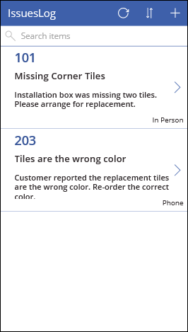
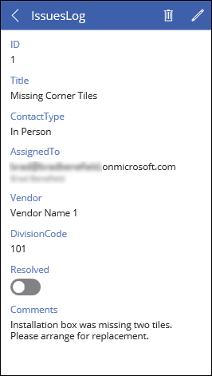
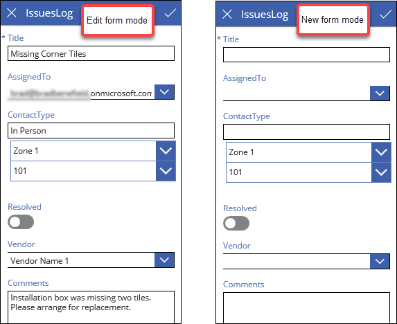
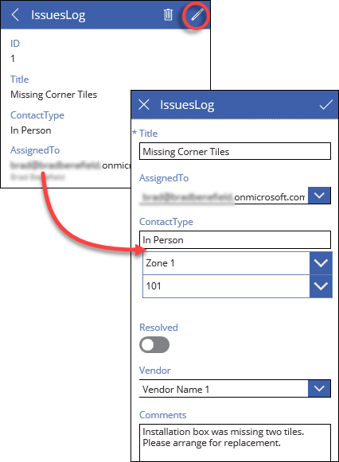
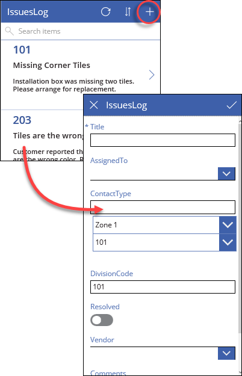

<properties
   pageTitle="Determine whether a form is in edit mode | Microsoft PowerApps"
   description="Differences between an edit form and a new form"
   services=""
   suite="powerapps"
   documentationCenter="na"
   authors="v-subohe"
   manager="anneta"
   editor=""
   tags=""/>

<tags
   ms.service="powerapps"
   ms.devlang="na"
   ms.topic="get-started-article"
   ms.tgt_pltfrm="na"
   ms.workload="na"
   ms.date="06/23/2017"
   ms.author="v-subohe"/>

# Understand the difference between an edit form and a new form
In the previous video, you saw how to create cascading drop-down lists. This section, discussed the differences between an edit form and a new form, and how it affects how the data is displayed in those lists and other fields.

## A quick review of screens and forms

When you create an app from SharePoint, PowerApps automatically builds an app with three screens, which you can view and access in the left-hand navigation pane: a **Browse** screen, a **Details** screen, and an **Edit** screen. 

The **Browse** screen contains a **gallery**, which shows all the items in your data source. 

The **Details** screen contains a **display form**, which displays the details of a selected item. 

The **Edit** screen contains an **edit form**, which can be used two ways: in **edit form mode**, to modify an existing item, or in **new form mode**, to create a new item. It's the same form, but how it displays depends on how you get there. 

## Edit form mode vs. New form mode

**Edit form mode** - If you click the pencil icon on the **Details** screen of an item, the **Edit** screen opens in **edit form mode**, and displays the data for the current item for you to edit.

**New form mode** - If you click the "**+**" on the **Browse** screen,  the **Edit** screen opens in **new form mode**, and displays the empty fields that you can edit to create a new item. 

Notice that in the **new form mode** example, some of the fields already have data. This is default data and isn't a problem in **new form mode**, because you can just overwrite the default values with your new values. However, when you open an item in **edit form mode**, you'll want the data that is displayed to be the current, or authoritative, data that is in the SharePoint list, not the default data.

The following example shows the detail screen for another item along with the **edit form mode** of the item. 

The **DivisionCode** value of **203** in the detail screen is correct. (Although it's not shown on the detail screen, the Zone value is **Zone 2**, and the subcode is **203**.) However, when it's opened in **edit form mode**, the default form values are displayed instead of the actual values. 

To make sure the correct values are displayed in **edit form mode**, the app needs to do two things:

1. Determine if the form is in **edit form mode**.
2. If it is, then set the values to the current SharePoint values. 

You can do this by using an **If** function in the formulas for the **Default** properties of these fields.

## Determine whether a form is in edit mode

In the previous video, you made the **DivisionCode** field invisible. Before you start, you'll need to make it visible again in order to edit it.

1. In the left-hand pane, under **EditScreen1**, select **EditForm1**.
1. In the right-hand pane, select **Data**, then scroll down in **Fields** and select **DivisionCode**. 
1. Click **Properties**, and set **Visible** to **on**. 

    

### Division Code field

Select the **Division Code** field, and select **Default** from the property list. The current value is **ddSubCodes.Selected.Value**, which simply gets whatever value is in the current **ddSubCodes** field. You can use an **If** function to determine which mode the form is in, and which action to take. Change the value to this formula:

**If(EditForm1.Mode=FormMode.Edit,Parent.Default,ddSubCodes.Selected.Value)**

- **EditForm1.Mode=FormMode.Edit**: determines if the form is in **edit form mode**. 
- **Parent.Default**: if true, it gets the value from the SharePoint **IssuesLog** list (the SharePoint list being the *parent*, or data source).
- **ddSubCodes.Selected.Value**: if false, then it gets the value from **ddSubCodes**.

### Zones field

You can also use an **If** function for the **ddZones** field. However, remember that the data source for the **ddZones** field is the **Zones** list, not the **IssuesLog** list (the *parent*). You can still access the **Zones** list, though, by using a **Lookup** function. Change the **Default** property to this formula:

**If(EditForm1.Mode=FormMode.Edit,LookUp(Zones,ThisItem.DivisionCode in SubCode,Title))**

- **EditForm1.Mode=FormMode.Edit**: determines if the form is in **edit form mode**.
- **LookUp(Zones,ThisItem.DivisionCode in SubCode,Title)**: if true, it gets the value of **DivisionCode** from the current item, looks in the **SubCode** column of the **Zones** list for a match, and then gets the **Title** (or Zone) for that SubCode. 

### SubCode field

The **SubCodes** field uses another **If** function. Select the **Default** property, and change it to this formula:

**If(EditForm1.Mode=FormMode.Edit,ThisItem.DivisionCode)**

- **EditForm1.Mode=FormMode.Edit**: determines if the form is in **edit form mode**.
- **ThisItem.DivisionCode**: if true, then use the value of **DivisionCode** from the current item.

Test the app after making these changes, and see how the values display differently depending on which mode you are in.
As you create apps, keep in mind how the default values can affect what is displayed to the user when they are editing an existing item or creating a new item.
