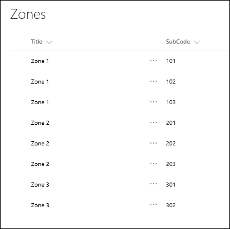

  <properties
   pageTitle="Add data to SharePoint to prepare to create an app | Microsoft PowerApps"
   description="Build additional data into SharePoint to prepare for creating an app"
   services=""
   suite="powerapps"
   documentationCenter="na"
   authors="v-subohe"
   manager="anneta"
   editor=""
   tags=""/>

<tags
   ms.service="powerapps"
   ms.devlang="na"
   ms.topic="get-started-article"
   ms.tgt_pltfrm="na"
   ms.workload="na"
   ms.date="06/07/2017"
   ms.author="v-subohe"/>

# Building a SharePoint list to use in an app
In previous sessions, you created two apps for Contoso hardwood flooring. The first app estimated the cost of the flooring for the size of the room, and the second displayed sales figures for the cities and countries. Next, you'll create an app for the workers who are installing the flooring. This app lets them log any issues they encounter on a job. It will store the data on your SharePoint site, and workers can add issues to SharePoint using the app.

## Add a new SharePoint list 

In this session, you'll create two SharePoint lists that you'll use to build the app over the next several sessions.  

On your SharePoint site, create a new custom list, and name it **IssuesLog**.  After SharePoint creates it, open the **IssuesLog** list from the contents page. 

## Add columns to the list 

In the **IssuesLog** list, create six new columns.

Column 1
- Type: **Single line of text**
- Column name: **ContactType**

Column 2
- Type: **Person**
- Column name: **AssignedTo**

Column 3
- Type: **Choice**
- Column name: **Vendor**
- Additional column settings: **Type each choice on a separate line**
  - **Vendor Name 1** (Default value)
  - **Vendor Name 2**
  - **Vendor Name 3**

Column 4
- Type: **Single line of text**
- Column name: **DivisionCode**

Column 5
- Type: **Yes/No**
- Column name: **Resolved**

Column 6
- Type: **Multiple lines of text**
- Column name: **Comments**

Add one new item to the list so that something displays when you build the app. Click or tap **New** in the upper left-hand corner, and in **New Item**, add some data in each field in the list. Click or tap **Save** to save the item.

After creating the columns and adding an item, your SharePoint list should look similar to this:

## Add another list for the DivisionCode field 

Contoso Flooring uses three division zones, and each zone has multiple codes. In the app, you'll want to be able to select a zone and see only the codes for that zone. You'll do this in the app by using a cascading drop-down list. To populate the drop-down list, you need to add another SharePoint list.

Create a new custom list, and name it **Zones**.  After SharePoint creates it, open the **Zones** list from the contents page.

Add one new column to the list:
- Type: **Single line of text**
- Column name: **SubCodes**

Click or tap **Quick edit** in the upper left-hand side to add the zones. In the table that appears, under the **Title** column, type each zone, and, under the **SubCode** column, type each subcode. For example:

- **Zone 1** : **101**
- **Zone 1** : **102**
- **Zone 1** : **103**
- **Zone 2** : **201**
- **Zone 2** : **202**
- **Zone 2** : **203**
- **Zone 3** : **301**
- **Zone 3** : **302** 

After saving the edits, your SharePoint list should look similar to this:

In the next session, we'll discuss how to build the app.
