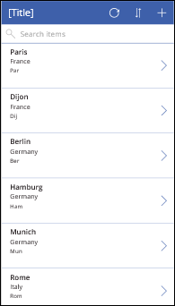
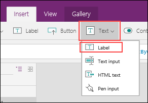

<properties
   pageTitle="Display data in a collection using a gallery | Microsoft PowerApps"
   description="Display data in a collection using a gallery and modify some of the fields"
   services=""
   suite="powerapps"
   documentationCenter="na"
   authors="skjerland"
   manager="anneta"
   editor=""
   tags=""/>

<tags
   ms.service="powerapps"
   ms.devlang="na"
   ms.topic="get-started-article"
   ms.tgt_pltfrm="na"
   ms.workload="na"
   ms.date="10/06/2017"
   ms.author="sharik"/>

# Display data in a collection using a gallery
In the first topic in this section, you created a collection using a formula. Now you're going to use the data in that collection to populate a gallery, and then change some of the fields in the gallery template.

## Select a gallery layout and theme
First, you need to select a gallery layout that best displays the data. Notice that the default gallery layout contains a graphic placeholder. The data doesn't need to display any graphics, so select a layout that only displays text.

Make sure that the gallery is selected, and in the right-hand pane, click or tap **Data**, click or tap the **Layout** drop-down, and then select the **Title, subtitle, and body** layout. You'll see the layout change to a group of text fields.

**Tip:** If you want, you can select a color theme to use for the app. On the **Home** tab, click or tap **Theme**. You can change the theme at any time, and PowerApps will automatically color the controls to fit the new theme.

## Load data from the data collection
Next, you'll configure the gallery to display the data from the collection you created in the last topic. Select the gallery and look at the formula displayed in the formula bar for the **Items** property. The value of this property determines the source of the data that appears on the screen, as well as the filter and sort columns.

**SortByColumns(Search(CustomGallerySample, TextSearchBox1.Text, "SampleText"), "SampleText", If(SortDescending1, Descending, Ascending))**

Modify the formula so that it uses the **CitySales** data collection, searches on **City**, and sorts by **Country**:

SortByColumns(Search(**CitySales**, TextSearchBox1.Text, "**City**"), "**Country**", If(SortDescending1, SortOrder.Descending, SortOrder.Ascending))

Your app should now look similar to this:

## Change elements in the gallery template
You can customize the gallery by changing some of the elements, and adding or removing fields.

You may have noticed that the layout only has three fields, while the data collection has four columns. To add another field to the gallery template, select the first item and drag the bottom down to make some extra room, and then add a new text label from the **Insert** tab.

In the right-hand pane, select the drop-down for the new label, and then select the field that isn't displayed yet.

Now, let's change the title of the gallery. Double-click or tap in the title area of the gallery to select it, and then type a new title, for example **Flooring Sales**.

Since you won't be adding new items to the data using this app, you can hide the "add new" (**+**) icon in the title area of the gallery. To do this, click or tap the (**+**) icon to select it, and then select **Visible** in the property list. Then, in the formula bar, change the variable to **false** to hide the icon. If there are other icons that your app doesn't need, you can hide them the same way.

You're done! Press **Ctrl+S** to save your work.

In the next topic, you'll learn how to customize a gallery template further by adjusting the formatting and overall appearance.
