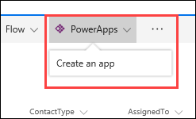
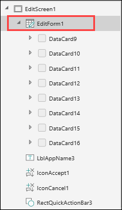
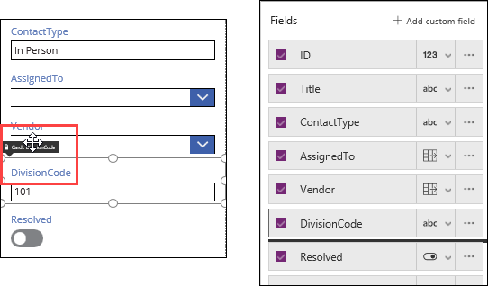
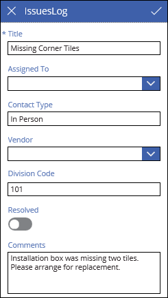

<properties
   pageTitle="Understand the basics of creating forms | Microsoft PowerApps"
   description="Understand the basics of creating forms including expanding fields in a form and unlocking property settings to customize a form"
   services=""
   suite="powerapps"
   documentationCenter="na"
   authors="v-subohe"
   manager="anneta"
   editor=""
   tags=""
   featuredVideoId="Y057qUJ2NNk"
   courseDuration="11m"/>

<tags
   ms.service="powerapps"
   ms.devlang="na"
   ms.topic="get-started-article"
   ms.tgt_pltfrm="na"
   ms.workload="na"
   ms.date="08/05/2017"
   ms.author="v-subohe"/>

# Creating forms in an app
In the previous topic, you prepared data in SharePoint and created two lists: **IssuesLog** to store the data the app is collecting, and **Zones** to store the data on division zones and subcodes. This topic discusses the basics of creating an app from SharePoint and customizing it. We will build on this in subsequent topics.

## Create a new PowerApp from SharePoint

1. Open the **IssuesLog** list, and at the top, click or tap **PowerApps**, and then click or tap **Create an app**.

    

2. Type a name for the app, for example **Installation issues**, and click **Create**.

After the app builds, it opens in PowerApps Studio for web. Without doing anything else, your app is now fully functional. Test the app by running it in preview mode and opening an item for editing. Make a change to one of the fields, submit the form, and verify that the change you made now appears in the SharePoint list.

There are many things you can do to customize the app. For example, you can adjust the fields in the template gallery to match the view that you want.

    

**Note:** Your app might show different fields from the **IssuesLog** list. You can change the fields in the right pane, on the **Data** tab.

## Customize the edit form

In the left-hand navigation tree, under **EditScreen1**, select **EditForm1**. This is the form that the user will fill out when they create a new item.

When working with forms, you're working with independent sections of the form called **data cards**. In the left-hand navigation tree, under **EditForm1**, you can see all the data cards (and other controls) that make up the form. Each data card is independent and can have its own unique formatting. This is different from a gallery where if you make a change to the template, it affects the entire gallery.

Data cards can be arranged on the form by dragging the handle in the upper left of the data card, or by dragging the fields in the right-hand pane. They can also be resized or have their properties customized like any other control. 

Modify the data cards as follows:

1. Make sure the **Visible** property of the **ID** data card is set  to **false**.

1. Move the **AssignedTo** field so it's above the **ContactType** field. 

1. Edit the titles for **AssignedTo**, **ContactType**, and **DivisionCode** to add a space between the words. 

1. In the right-hand pane, select **Data**. Scroll down to the **Comments** field, select the **abc** drop-down, and select **Edit multi-line text**. This expands the text box to display the multi-line comment. 

1. Save your app.

Your form should look similar to this now:

**Note: ** Some data cards may be locked by default to prevent accidental changes. To unlock a data card, select the data card, select **Advanced** in the right-hand pane, and click **Unlock to change properties**.

